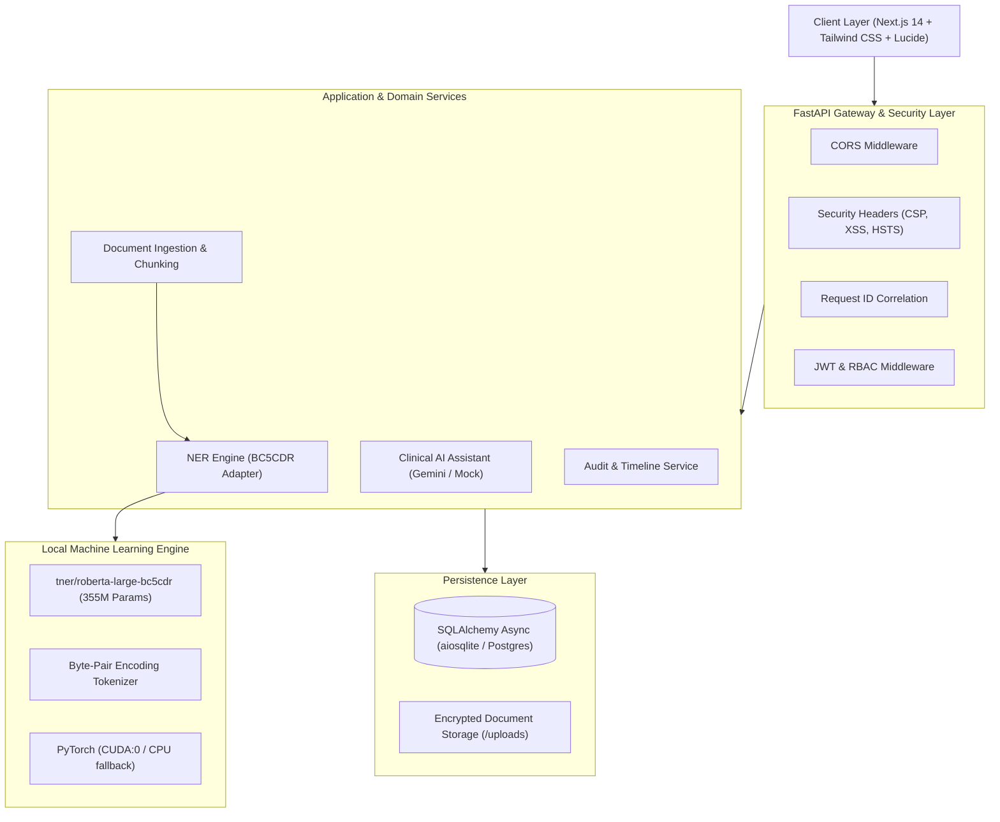
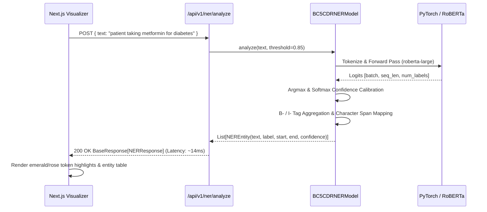
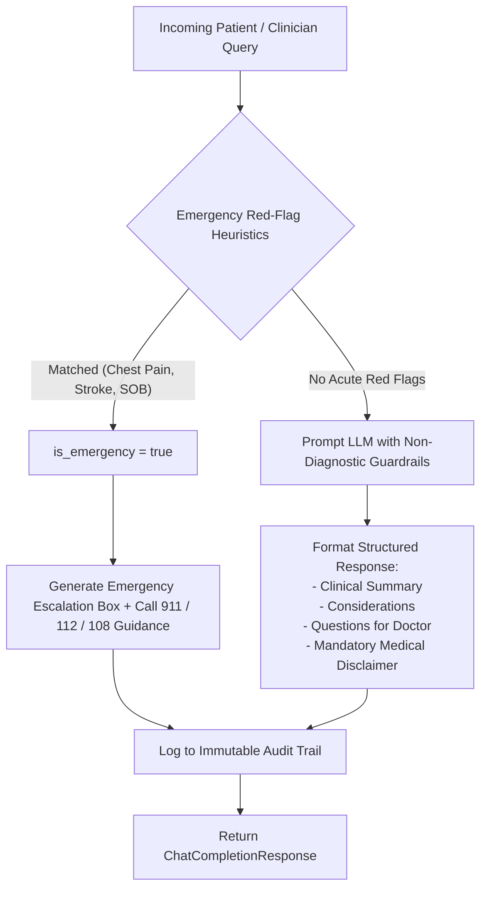

# SanjeevaniAI — System Architecture & Design Specification

## 1. Architectural Overview

**SanjeevaniAI** is an industry-grade healthcare intelligence and clinical decision-support platform. The architecture is engineered around the principles of:
- **Local Machine Learning Sovereignty**: Pretrained neural NER model (`tner/roberta-large-bc5cdr`) runs completely on local hardware without sending sensitive clinical text to external third-party entity extraction APIs.
- **Provider-Agnostic Clinical Assistant**: Pluggable LLM interface supporting Google Gemini Pro and deterministic offline `MockLLMProvider` with heuristic red-flag emergency triage.
- **Data Integrity & Traceability**: Multi-format document ingestion (PDF, DOCX, TXT) with SHA-256 fingerprinting and immutable security audit trails.
- **Explicit Clinical Positioning**: Non-diagnostic language safeguards throughout all API contracts and UI surfaces.

---

## 2. Component Hierarchy

### 2.1 Backend Architecture (`backend/app/`)
- **`core/`**:
  - `config.py`: Centralized Pydantic BaseSettings loaded from `.env`.
  - `security.py`: Direct `bcrypt` password hashing (protecting against the 72-byte passlib bug) and JWT token generation.
  - `database.py`: Asynchronous SQLAlchemy engine (`AsyncSessionLocal`) with automatic table initialization.
  - `logger.py`: Structured RFC-3339 logging with correlation IDs.
  - `exceptions.py`: Domain exception taxonomy mapping cleanly to HTTP 400/401/403/404/422/500 responses.
- **`models/`**:
  - `User`, `PatientProfile`: User accounts and clinical health profile (anthropometrics, allergies, chronic conditions, active medications).
  - `MedicalDocument`, `DocumentAnalysis`, `MedicalEntity`: Document storage metadata, SHA-256 hash, extracted summary, and labeled token entities (`CHEMICAL`, `DISEASE`).
  - `AIConversation`, `AIMessage`: Multi-turn consultation threads with structured JSON payloads.
  - `AuditLog`, `AnalysisHistory`, `SystemEvent`: Audit trail and chronological patient timeline.
- **`ml/`**:
  - `BC5CDRNERModel`: Thread-safe model wrapper loading weights from `models/bc5cdr-ner` using PyTorch. Performs sub-word token alignment, confidence thresholding (default $\tau = 0.85$), and entity offset calculation.
  - `ModelManager`: Singleton lifecycle manager preventing duplicate GPU VRAM allocations.
- **`services/`**:
  - `DocumentService`: Safe multi-format parser (`pypdf`, `pdfplumber`, `docx2txt`), chunker, and entity aggregator.
  - `LLMService`: Multi-provider abstraction (`GeminiProvider`, `MockLLMProvider`) implementing prompt defense guardrails and emergency red-flag heuristics.

---

## 3. Biomedical NER Inference Pipeline

---

## 4. Emergency Triage & Decision-Support Flow

---

## 5. Security & Healthcare Privacy Architecture

1. **Local-First Data Processing**: PHI in uploaded documents is parsed in memory and analyzed against the local neural network.
2. **Cryptographic Integrity**: Uploaded files are fingerprinted with SHA-256 before storage to detect tampering.
3. **Role-Based Access Control**:
   - `PATIENT`: Access own profile, medical documents, and consultations.
   - `DOCTOR`: Review patient clinical summaries and execute decision support.
   - `ADMIN`: View system telemetry, hardware metrics, and security audit logs.
4. **Standardized HTTP Security Headers**: HSTS, X-Content-Type-Options, X-Frame-Options (`DENY`), and Content-Security-Policy applied on every response.
